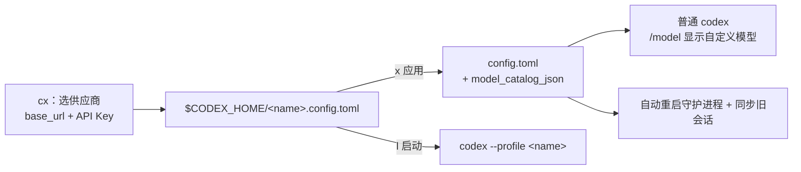

# codex-profiles (`cx`)

一个面向 OpenAI Codex 的 **TUI 配置管理器**：可视化地管理供应商 / 模型 / API Key、
生成模型目录、同步会话、统计 Token 用量，并且全程可回退、密钥脱敏。

---

## 为什么

- **Codex 0.160 废弃了旧的 profile 写法**：`config.toml` 里的 `profile = "..."` / `[profiles.*]`
  会被直接拒绝；官方只支持 `$CODEX_HOME/<name>.config.toml` + `codex --profile <name>`。
- **切换供应商后旧会话会失效**：会话里记的是旧 provider，恢复 / 压缩时可能报错。
- **自定义供应商的模型不出现在 `/model`**：Codex 只展示它自己的模型目录。
- **手改 `config.toml` 容易改坏**：没有备份、没有校验，还容易把 key 泄露到终端 / 日志。

`cx` 把这四件事收进一个界面里。

## 是什么

| 能力 | 说明 |
|---|---|
| profile / 供应商 | 模型、provider、API Key、`base_url`、模型目录，一处编辑 |
| 应用 / 启动 | 应用进 `config.toml`（普通 `codex` 生效），或按 `--profile` 启动 |
| 模型目录 | 生成 `model_catalog_json`，让 `/model` 只显示你的模型 |
| 会话管理 | 列出本地会话、恢复、删除；切换供应商后自动同步 provider 元数据 |
| Token 用量 | 按模型 / 日期 / 会话统计，含缓存命中率、推理 token |
| 快照 / 还原 | 改前提示保存，可撤销应用、还原到 Codex 原始配置 |

**安全约定**：永不读写 `auth.json`；只写 `<name>.config.toml` 与 `config.toml`；
写入前备份、原子替换；界面与日志里的 key 一律脱敏；含 key 的文件权限 `600`。

**一句话原理**：profile 存成 `$CODEX_HOME/<name>.config.toml`；「应用」把它合并进
`config.toml` 并写入 `model_catalog_json`（Codex 的权威模型目录）；「启动」则用
`codex --profile <name>`。改完自动重启 app-server 守护进程并同步旧会话。



---

## 怎么做

### 0. 环境要求

- **Python ≥ 3.11** 与 [**uv**](https://docs.astral.sh/uv/)
- **Codex CLI** 已安装（`codex` 在 PATH 上）

```bash
codex --version   # 确认可用
uv --version
```

### 1. 安装

```bash
git clone <your-repo-url> ~/ai/cx
cd ~/ai/cx
uv tool install .          # 安装 `cx` 到 ~/.local/bin
```

> 开发 / 本地运行：`uv run cx`（改动即时生效）。

### 2. 快速开始（3 步）

```bash
cx
```

1. 按 **`a`** → 选供应商（OpenAI 官方 / 内置预设 / 自定义）→ 填 **`base_url` + API Key** → 保存；
2. 按 **`x`** 应用到 `config.toml`（普通 `codex` 即可用）；
3. 新开终端运行 `codex`，用 `/model` 选择你的模型。

### 3. 快捷键

| 键 | 作用 |
|---|---|
| `a` | 新增 profile（先选供应商：官方 / 预设 / 自定义） |
| `e` | 编辑选中项（供应商 + 模型 + API Key 同一表单） |
| `E` | 用 `$EDITOR` 直接改 TOML |
| `d` | 删除选中 profile |
| `space` | 设为 active（供 `cx run` / `l` 使用） |
| `x` | **应用**进 `config.toml`（普通 `codex` 直接生效） |
| `u` | 撤销应用 / 还原应用前状态 |
| `s` | 快照：点击仅选中，回车恢复，`d` 删除 |
| `R` | **还原 Codex 原始配置** |
| `S` | **会话管理** |
| `U` | **Token 用量统计** |
| `v` | 用真实 codex 二进制验证该 profile（`--ephemeral`，不产生会话） |
| `l` | 启动 `codex --profile <name>`（只影响这次会话） |
| `t` | 切换主题（移动光标实时预览） |
| `r` / `q` | 刷新 / 退出 |

### 4. 配置供应商与 API Key

按 `a` 选供应商（或 `e` 编辑），填写 **`base_url` + API Key**。

Codex 的 provider **没有** `api_key` 字段，只有 `env_key`（环境变量名）或
`experimental_bearer_token`（字面量）；`cx` 用后者，所以**不需要环境变量**：

```toml
[model_providers.myrelay]
name = "myrelay"
base_url = "https://my-relay.example/v1"
experimental_bearer_token = "sk-…"   # 表单里填的 API Key
wire_api = "responses"
```

内置预设：OpenAI Official、Kimi、DeepSeek、Zhipu GLM、Qwen、火山豆包、SiliconFlow、
百度千帆、腾讯混元、StepFun、MiniMax、xAI、OpenRouter、Novita、Nvidia、ModelScope、
Longcat，以及从 **pi** 导入的 Meta / Groq / Cerebras / Fireworks / Together /
Hugging Face / Moonshot / Qwen Token Plan / Xiaomi / Z.AI / OpenCode Zen·Go 等。

### 5. 让 `/model` 显示你的模型

保存带 `base_url` 的供应商时，`cx` 会生成 `~/.config/cx/catalogs/<name>.json` 并写入
`model_catalog_json`；这是**权威目录**，`/model` 就只显示这些模型（不再有自带 gpt 模型）。

模型来源优先级：表单里 **Detect models** 拉取的全量 > 内置预设 > 手填的单个模型。
只想临时用某个供应商而不改全局，用 **`l`**（`codex --profile <name>`）。

**应用 vs 启动**：`x` 合并进 `config.toml`（普通 `codex`、VS Code、App 都生效），
并清理上次应用留下、已不再引用的 provider（只删 `cx` 自己加的，你手动加的不动）；
`l` 只对这次会话生效，不改全局。

### 6. 会话管理

按 **`S`**：

- 列出**所有**本地会话（`state_*.sqlite` + rollout），显示 `provider · model · 时间 · tokens`；
- **回车**用当前 active profile 恢复（`codex --profile <name> resume <id>`）；
- **`d`** 删除（永久，改前备份）。

> 切换供应商时，`cx` 会自动把旧会话的 provider 元数据**原地同步**到当前供应商，
> 不会复制出新会话；恢复也始终是同一个 session。

### 7. Token 用量

按 **`U`**：解析 rollout 的 `token_count` 事件，显示总 tokens、输入 / 缓存 / 输出 /
推理、缓存命中率，以及按模型 / 日期 / 主会话的分布（子代理用量并入所属主会话）。

### 8. 快照 / 还原

- 每次修改 `config.toml` 前都会**询问是否保存快照**（不自动保存）；快照按内容去重，
  命名为 `<配置名>.<时间戳>.toml`；
- 三级回退：`u` 撤销最近一次应用 · `R` 还原原始配置 · `s` 选任意快照。

### 9. 安全与密钥

- key 以明文存在 `config.toml` / profile 文件里（Codex 机制决定），这些文件与所有备份
  都会被 `cx` 收紧到权限 `600`；
- 界面与日志里的 key 通过 `cx/redact.py` 脱敏（如 `sk-l…7890`）；
- 想彻底不让 key 进配置，可改用 `env_key = "VAR"` 并自行导出环境变量。

### 10. 涉及的文件

| 路径 | 作用 |
|---|---|
| `$CODEX_HOME/<name>.config.toml` | profile 文件（由 `cx` 创建） |
| `$CODEX_HOME/config.toml` | 应用目标（普通 `codex` 读取） |
| `~/.config/cx/active` | 当前选中 profile |
| `~/.config/cx/catalogs/` | 生成的模型目录（供 `/model`） |
| `~/.config/cx/backups/` | 被覆盖 / 删除的 profile 备份 |
| `~/.config/cx/config-backups/` | `config.toml` 快照 |
| `~/.config/cx/session-backups/` | 会话同步 / 删除前的备份 |
| `~/.config/cx/theme` | 主题 |

### 11. 故障排查

| 现象 | 原因 / 处理 |
|---|---|
| `Missing environment variable: XXX_API_KEY` | 该 provider 用了 `env_key`。在 `cx` 里 `e` 编辑，改填 **API Key**（写入 bearer），或自行导出该环境变量 |
| `401 API_KEY_REQUIRED` | provider 没有任何 key：`e` 编辑填 API Key |
| `/model` 仍是官方模型 | 没按 `x` 应用，或应用的不是带 `base_url` 的 profile |
| 切换后旧会话报错 | `cx` 会自动同步；也可在 `S` 里查看状态 |
| 守护进程缓存了旧模型 | `cx` 应用后会自动重启；手动可 `codex app-server daemon restart` |

### 12. 开发

```bash
uv sync
uv run cx          # 本地运行
uvx ruff check src/cx
```

---

## 许可

见 `LICENSE`。本项目为个人使用的非官方工具，与 OpenAI 无关。
